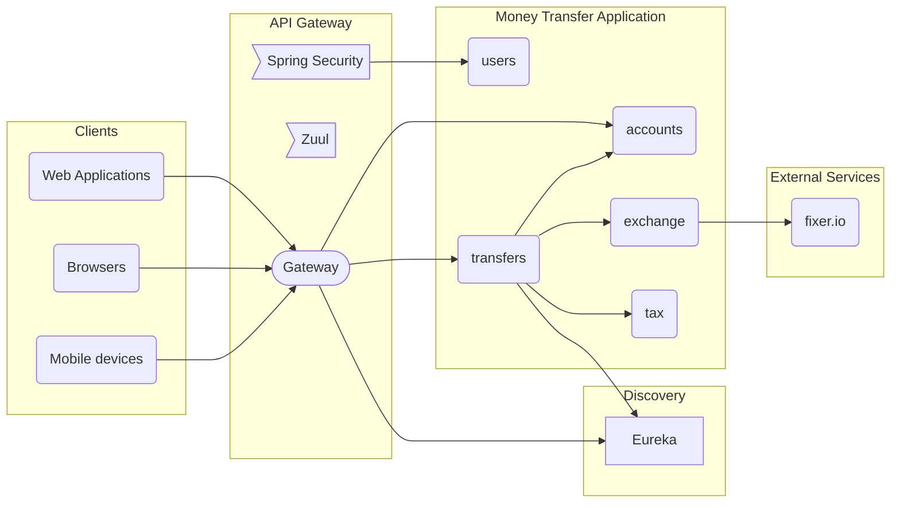

# Money transfer (microservice application)

This is the final version of money transfer application, using a full solution with microservices.

The application consists of an API Gateway and an Eureka Server. The gateway should
receive all incoming requests and provide balancing, routing, security and monitoring.
The Eureka server is the discovery service used by the gateway and inner services to
reach other services in the microservice topology.

Business services are explained below in more details.

This application was built with the following stack:

- Eureka Server
- Zuul
- Spring Boot
- Spring Security
- JPA
- HATEOAS
- OpenFeign
- H2 Database (_in memory_)

## Decisions

It was decided not to use a Kafka server in this MVP application, as there is only
one transaction (money transfer) and Kafka queues add more complexity to the
whole application.

Repeatable read isolation level was used for transactions in accounts service
to ensure origin account balance should not change during money transfers.

An exchange service was used to isolate calls to an external application and
provide fallbacks in the future, since exchange operations can use more than
one API.

A tax service was created to isolate business rules related to tax computations.

Transfers themselves were apparted in two services: accounts and transfers.
Accounts service hold balances for user accounts and transfers service does
the orchestration necessary to ensure money transfer processing.

Transfers, users and accounts are using in memory H2 databases for this demo,
but this should be changed to installed DBMS in production version.

## How to run

You need Maven installed or an Spring Boot compatible IDE.

Run `mvn spring-boot:run` for each of the services in the topology in the following order:

1. Eureka Server
2. All other services, except gateway
3. Gateway

The application should work fine in any order, but the suggested order gets it working
more quickly.

You can see application status in [Eureka server](http://localhost:8761). To send requests
to application, use [Gateway service](http://localhost:8080).

## Credentials

This application uses Basic Authentication mocked into the gateway server. Two users have
authorized credentials:

- `iurylazoski@mstest.org:#11pass`
- `johndoe@other.com:other!pass`

## API

Credentials should be configured for all requests.

* *GET* `/public/accounts/users/{userId}`
  - Sample response:
```
[
	{
		"id": 2,
		"userId": 2,
		"number": "98463",
		"balance": 15000.00
	},
	{
		"id": 3,
		"userId": 2,
		"number": "38473",
		"balance": 2000.00
	}
]
```
* *POST* `/public/transfers`
  - Sample message body:
```
{
	"originAccountNumber": "98463",
	"recipientAccountNumber": "78657",
	"amount": 200,
	"description": "basic transfer",
	"currencyId": "USD"
}
```
  - Sample response:
```
{
	"id": "212e99bb-eae0-4919-b02e-4fa5f3d97767",
	"taxCollected": 10.00,
	"amountInCAD": 0
}
```
* *GET* `/public/transfers`
  - Sample response:
```
[
	{
		"id": "8530aa87-cd1b-412e-a94a-7dcf9ecf5404",
		"originAccountNumber": "98463",
		"recipientAccountNumber": "78657",
		"amount": 20000.00,
		"description": "basic transfer",
		"date": "2021-12-22",
		"currency": "USD",
		"state": "ERROR"
	},
	{
		"id": "e1a8f9e7-a73c-4104-a638-28bcba12f6df",
		"originAccountNumber": "98463",
		"recipientAccountNumber": "78657",
		"amount": 200.00,
		"description": "basic transfer",
		"date": "2021-12-22",
		"currency": "USD",
		"state": "PROCESSED"
	}
]
```

Sample request:
```
curl --user iurylazoski@mstest.org:#11pass -X POST -H "Content-Type: application/json" \
	-d '{ "originAccountNumber": "78657", "recipientAccountNumber": "98463", "amount": 200, "description": "basic transfer", "currencyId": "USD" }' \
	http://localhost:8080/public/transfers
```

## Microservice diagram

Important note:

- Services contained in the box entitled _Money Transfer Application_ **MUST**
be protected from external clients. In other words, all trafic should pass through
**API Gateway** application. It should be enough to not expose ports of inner services
to the outside world when deploying to the cloud.

> You need a mermaid compatible renderer to see below graph


## Services explained

### API Gateway

The gateway should receive all incoming requests and provide balancing, routing, security, resiliency and monitoring.

Currently user accounts are mocked in this application. In production, an Authorization Server should be used.

### Users

This is the repository for user data, such as name and e-mail.

### Accounts

This is the repository for user accounts, including account balance.

This service is also responsible for the final part of money transactions.
Balance is double checked in this application before committing transactions.

### Exchange

This is a middle server for [Fixer](https://fixer.io).

As this service depends on external applications, it should have fallbacks in case of
issues with the external application.

When running this application, it is necessary to pass a command line argument to inform
the key for fixer.io API:

```
mvn spring-boot:run "-Dspring-boot.run.arguments=--org.iuryl.mstest.fixer.io.key=<key>"
```

### Tax

This service calculates taxes for transfer requests based on business rules.

### Transfers

This is the main server accessed by users. Transfer requests are processed by this service
with several requests to other services.

Transfer entity is persisted into a database with all the information required to
process transfer, calculated tax is a good example.

Service must validate transfers using format rules and business rules.
It also ensures that accounts have enough balance before sending a request for
a money transfer to accounts service.

## Scalability

* Eureka Servers are naturally scalable, it is enough to configure the servers to know
the endpoints to ping their siblings.

* Gateway service cannot be scaled as it is now. To scale the gateway service, it
is necessary to turn off the load balancing properties of it and have a separate
service just for load balancing - cloud platforms usually offer this service.

* All other business services should be entitled for scaling. Obviouslly, one is
assumming that in memory databases will be replaced by physical databases.

## Traceability

To enable time tracing in transfer service, add the following
line to `application.yaml`:
```
logging:
  level:
    org.iuryl.mstest.transfers.infra: TRACE
```

## Testing

Transfer service has unit and integration tests covering the main points.
More tests should be added in the future to ensure good coverage.

### Interface tests

Application has been manually tested against these and other cenarios using Insomnia.
These could be converted to end-to-end automated tests in the future to ease
doing regression tests.

1. Deadlock: ensure no deadlocks in account service in case of concurrent transactions
affecting same account.
2. Service downtime: ensure users get a good response in case of service downtime.
3. Consistency: ensure account balances are consistent after several concurrent
transactions affecting same group of accounts.

### End-to-end tests

A new application should be constructed to make proper end-to-end tests from the
outside of the application.

Following scenarios are proposed:

1. Authorization in Gateway service.
2. Service discovery in business services.
3. External dependencies in transfer services.
4. Internal dependencies in transfer services.
5. Transaction management in account services.
6. Fallback endpoints in case of service downtime.